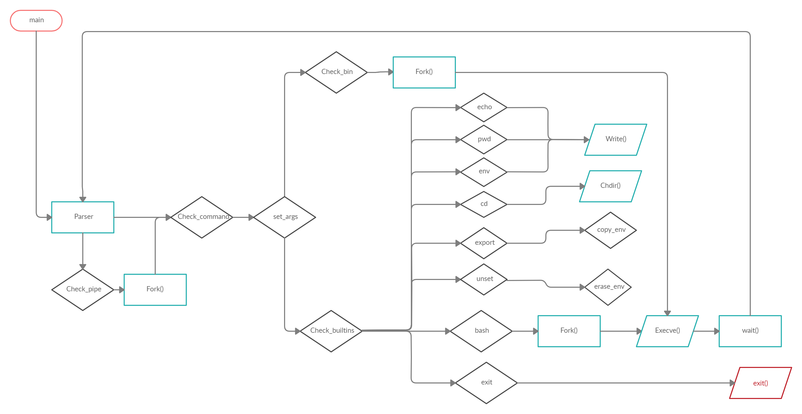

# minishell


### Index 📋
You're sections headers will be used to reference location of destination.

- [Description](#description)
    - [Scheme](#scheme)
	- [Developed commands](#developed-commands)
	- [Allowed Functions](#allowed-functions)
- [How To Use 📦](#how-to-use)
- [References 📌](#references)
- [License 📄](#license)
- [Author Info  ✒️](#author-info)

---

## Description
The goal of this project is to create a simple shell. Will be your own little
bash or zsh. You are going to learn a lot about processes and file descriptors.

---

### Scheme


[Back To The Top](#minishell)

---

### Developed commands
```bash
- Find and launch the appropriate executable.
- Builtins:
    - echo (-n flag included)
    - cd (with absolute and relative path)
    - pwd
    - export
    - unset
    - env
    - exit
- ; will have to separate the commands on the command line.
- Redirects >, “>>” y < should work as in bash, except in fd aggregations.
- Environment variables ($ followed by characters) should work like in bash.
- Pipes | should work like in bash.
- $? it should work like in bash.
- ctrl-C, ctrl-D y ctrl-\ should show the same result as in the bash.
```

[Back To The Top](#minishell)

---

### Allowed Functions
- **malloc**
- **free**
- **write**
- **open**
- **read**
- **close**
- **fork** = [Creates a child process.](https://man7.org/linux/man-pages/man2/fork.2.html)
- **wait, waitpid**  = [Stops the parent process until the child process exit.](https://man7.org/linux/man-pages/man2/waitid.2.html)
- **wait3, wait4** = [Are similar to waitpid, but additionally return resource usage information about the child.](https://man7.org/linux/man-pages/man2/wait3.2.html)
- **signal** = [Sets a function to handle a signal.](https://man7.org/linux/man-pages/man2/signal.2.html)
- **kill** = [Sends a signal to a process or a group of processes.](https://man7.org/linux/man-pages/man2/kill.2.html)
- **exit** = [Terminates a process immediately, special handle for child processes.](https://www.tutorialspoint.com/c_standard_library/c_function_exit.htm)
- **getcwd** = [Saves the pathname of your current working directory in a string.](https://man7.org/linux/man-pages/man2/getcwd.2.html)
- **chdir** = [Changes your current working directory.](https://man7.org/linux/man-pages/man2/chdir.2.html)
- **stat, lstat, fstat** = [Returns information about a file.](https://man7.org/linux/man-pages/man2/stat.2.html)
  - stat = Standar.
  - lstat = For symbolic links.
  - fstat = Gets the file from a file descriptor.
- **execve** = [Executes a program referred by a variable.](https://man7.org/linux/man-pages/man2/execve.2.html)
- **dup** = [Creates a copy of a file descriptor using the lowest numbereded unused descriptor.](https://man7.org/linux/man-pages/man2/dup.2.html)
- **dup2** = [Creates a copy of a file descriptor using the descriptor number given by the user.](https://man7.org/linux/man-pages/man2/dup.2.html)
- **pipe** = [It's used to create inter-process communication.](https://man7.org/linux/man-pages/man2/pipe.2.html)
- **opendir** = [Opens a directory stream.](https://pubs.opengroup.org/onlinepubs/009695399/functions/opendir.html)
- **readdir** = [Returns a pointer to a dirent structure representing the next directory entry in the directory stream.](https://www.man7.org/linux/man-pages/man3/readdir.3.html)
- **closedir** = [Closes the directory stream.](https://linux.die.net/man/3/closedir)
- **strerror** = [Returns an error message.](https://www.tutorialspoint.com/c_standard_library/c_function_strerror.htm)
- **errno** = [Number of last error, its a variable.](https://www.youtube.com/watch?v=IZiUT-ipnj0&ab_channel=JacobSorber)

[Back To The Top](#minishell)

---

## How To Use
> Deployment
```shell
git clone https://github.com/j53rran0/minishell.git
make
./minishell
```

## References
- [Variables de entorno](https://www.youtube.com/watch?v=ZX58AHhXpyA)
- [Sintaxis del shell](https://pubs.opengroup.org/onlinepubs/009695399/utilities/xcu_chap02.html)
- [Evaluation](https://github.com/Binary-Hackers/42_Corrections/blob/master/00_Projects/01_Unix/minishell/00.pdf)

### Functions
- [fork: parte 1](https://www.youtube.com/watch?v=VwjP-KFuZCM)
- [fork: parte 2](https://www.youtube.com/watch?v=Dt9z_ohQWHI)
- [fork & pipe](https://www.youtube.com/watch?v=oxWxcYoJJdM&ab_channel=WhileTrueThenDream)
- [signal: parte 1](https://www.youtube.com/watch?v=rNGlwqHpoGw)
- [signal: parte 2](https://www.youtube.com/watch?v=_Ks8q1KQ2Eg&ab_channel=WhileTrueThenDream)
- [exec](https://www.youtube.com/watch?v=yIe_9lqng2I)
- [stat](https://www.youtube.com/watch?v=LERSkW_pLBs)
- [readdir & opendir](https://www.youtube.com/watch?v=vbAfIGR_5XM)
- [pipe](https://www.geeksforgeeks.org/pipe-system-call/)
- [wait](https://www.geeksforgeeks.org/wait-system-call-c/)
- [dup & dup2](https://www.geeksforgeeks.org/dup-dup2-linux-system-call/)

[Back To The Top](#minishell)

---

## License
MIT License

Copyright [2020] [Paris Martínez Ruiz] [Jaime Serrano González]

Permission is hereby granted, free of charge, to any person obtaining a copy of this software and associated documentation files (the "Software"), to deal in the Software without restriction, including without limitation the rights to use, copy, modify, merge, publish, distribute, sublicense, and/or sell copies of the Software, and to permit persons to whom the Software is furnished to do so, subject to the following conditions:

The above copyright notice and this permission notice shall be included in all copies or substantial portions of the Software.

THE SOFTWARE IS PROVIDED "AS IS", WITHOUT WARRANTY OF ANY KIND, EXPRESS OR IMPLIED, INCLUDING BUT NOT LIMITED TO THE WARRANTIES OF MERCHANTABILITY, FITNESS FOR A PARTICULAR PURPOSE AND NONINFRINGEMENT. IN NO EVENT SHALL THE AUTHORS OR COPYRIGHT HOLDERS BE LIABLE FOR ANY CLAIM, DAMAGES OR OTHER LIABILITY, WHETHER IN AN ACTION OF CONTRACT, TORT OR OTHERWISE, ARISING FROM, OUT OF OR IN CONNECTION WITH THE SOFTWARE OR THE USE OR OTHER DEALINGS IN THE SOFTWARE.

[Back To The Top](#minishell)

---

## Author Info

### Paris
- Twitter - [@TroyaParisde](https://twitter.com/TroyaParisde)
- Instagram - [@parisdetroya42](https://instagram.com/parisdetroya42)
- 42 Madrid - [parmarti](https://profile.intra.42.fr/users/parmarti)

### Jaime
- 42 Madrid - [parmarti](https://profile.intra.42.fr/users/jserrano)

[Back To The Top](#minishell)
